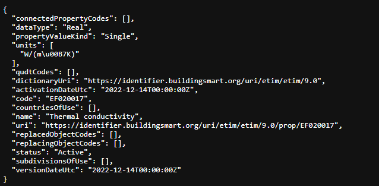

# Introduction
This repository hosts a proposed exchange protocol for building data. It is produced as part of the [Digital4CircularConstruction](https://www.buildwise.be/nl/onderzoek-innovatie/onderzoeksprojecten/de-bouwsector-milieuvriendelijker-en-meer-circulair-maken-door-digitalisering-d4c/) project by Buildwise

# Model
If you want to integrate the exchange protocol in your application, you can find the documentation on the model here: [Model](Model/README.md)

# Data dictionairies & Properties
The protocol uses URI's to identify properties to integrate the use of existing properties, published in data dictionairies. Only data dictionaries structured following EN ISO 23386 should be used. This means that the URI should return the property and its metadata (according to EN ISO 23386) in a structured json format, for example:\

\
The API returns the examples with properties hosted on the test environment of the bSDD (buildingSMART Data Dictionary). \
Example of such a property '[Global Warming Potential](https://identifier.buildingsmart.org/uri/LCA/LCA/3.0/prop/GWP_total)'\
If you want to search for other properties on the bSDD, use: https://search.bsdd.buildingsmart.org/ \
More about the bSDD: https://github.com/buildingSMART/bSDD

# Examples
See examples folder: [Examples](Examples/README.md)

# API
See API folder: [API information](API/README.md)

# FAQ

# Related standards and/or initiatives
This protocol is developed within a research project and can thus rapidely evolve. However, it is inspired by similar initiatives and tries to re-use concepts where possible, like:
- http://www.opendthx.org/w/Accueil
- https://lcax.kongsgaard.eu/

# Contact us
Got suggestions? Need help? Send an email to louis.casteleyn@buildwise.be

